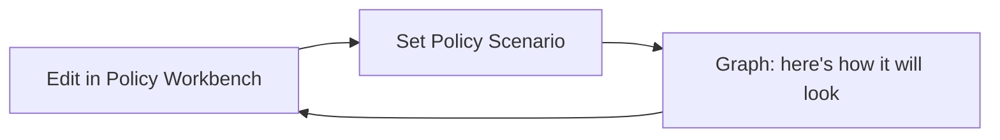
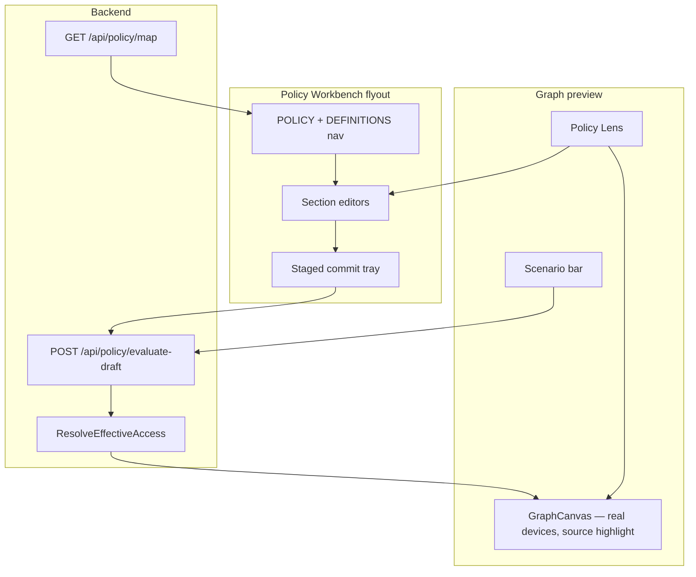

# Policy Workbench + graph simulation — master roadmap

Labels: ready-for-agent
Type: PRD

Master handoff for Tailor's policy editing and simulation direction. **Do not re-implement what is already shipped** (see baseline below).

**User priority for next milestone: Phase 1 — Policy Workbench shell ([019](019-policy-workbench-shell.md)).**

Reference UI: Tailscale admin **Access controls** visual editor — screenshots in [`screenshots of ACL in site/`](../../screenshots%20of%20ACL%20in%20site/).

Related issues: [011](011-graph-policy-preview-modes.md), [013](013-policy-lens-provenance-editor.md), [014](014-definition-workbench-editors.md), [015](015-ssh-and-posture-access-builder.md), [016](016-staged-commit-tray-and-hujson-diff.md), [017](017-advanced-policy-section-coverage.md)

---

## North star

Admins configure **any Tailscale ACL surface** in a familiar workbench, then see **how it will look** on the graph from a chosen simulation subject — without re-picking subjects or re-clicking Simulate after every edit.

**Two complementary surfaces:**

| Surface | Role | Tailscale analogue |
|---------|------|-------------------|
| **Policy Workbench** | Edit definitions and rules (breadth) | Access controls flyout: POLICY + DEFINITIONS nav |
| **Graph + Scenario bar** | Preview effective access (depth) | *Tailor-specific — not in Tailscale admin* |

Raw HuJSON remains an audit/escape hatch ([016](016-staged-commit-tray-and-hujson-diff.md)), not the primary editing experience.

---

## Policy Workbench information architecture

Mirror Tailscale's sidebar structure. Each nav item is a route inside the workbench flyout/panel.

### POLICY (rules that reference definitions)

| Nav item | Policy sections | Reference screenshot |
|----------|-----------------|-------------------|
| General access rules | `acls`, `grants` | `1-general-access-rules-outside.png`, `2-general-access-rules-clicked-in.png` |
| Tailscale SSH | `ssh` | `3-ssh-general.png`, `4-ssh-advanced.png` |
| Tests | `tests` | — |
| Auto-approvers | `autoApprovers` | — |

### DEFINITIONS (nouns referenced by rules)

| Nav item | Policy sections | Reference screenshot |
|----------|-----------------|-------------------|
| Groups | `groups` + autogroup reference table | `5-groups-general.png`, `6-groups-advanced.png` |
| Tags | `tagOwners` | `7-tags-general.png`, `8-tags-advanced.png` |
| IP sets | `ipsets` | `9-ip-sets-general.png`, `10-ip-set-advanced.png` |
| Hosts | `hosts` | `11-hosts-general.png`, `12-hosts-advanced.png` |
| Device posture | `postures` | `13-device-posture-general.png`, `14-device-posture-advanced.png` |
| Node attributes | `nodeAttrs` | `15-node-attributes-general.png`, `16-node-attributes-advanced.png` |

Each section: list + search → add/edit form → live JSON preview of the entry → stages to draft. Unsupported shapes fall back to structured JSON or raw HuJSON.

---

## Policy Scenario (simulation setup)

Orthogonal to the workbench nav. Persistent bar above the graph.

| Field | Purpose |
|-------|---------|
| **sourceSelector** | Who initiates connections (user, group, tag, autogroup, composite cohort) |
| **policyMode** | `current` / `draft` / `diff` |
| **graphMode** | `focused` / `all` (+ future ghost no-access) |
| **label** | Optional human name ("Ops member view") |

**View** = real devices on the graph, filtered/highlighted under the active scenario (see [Graph rendering model](#graph-rendering-model-default--no-hypothetical-root) below).

**Edit while simulating** = workbench mutations auto re-evaluate under active scenario (not yet automatic).

See [021-policy-scenario-state.md](021-policy-scenario-state.md) and [022-scenario-centric-editing.md](022-scenario-centric-editing.md).

---

## Graph rendering model (default — no hypothetical root)

The **Policy Scenario bar** carries “who am I simulating as?” The graph shows **only real tailnet devices** and answers “what can they reach?” — it does not inject a synthetic `perspective:<selector>` node.

This replaces the shipped perspective prototype (hypothetical root + edge remap + source collapse). That was a clutter-reduction hack; with the scenario bar and workbench, it adds confusion without being required for simulation.

### Default behavior (target)

When a scenario is active (`sourceSelector` set, Simulate committed):

| Layer | Behavior |
|-------|----------|
| **Scenario bar** | Shows selector, human label, source device count, policy mode, graph mode — primary “you are viewing as X” anchor |
| **Backend** | Unchanged: `perspective` on evaluate-draft → `devicesForPerspective` + src intersection ([023](023-composite-source-cohorts.md) fixes member semantics) |
| **Source devices** | Real devices in the cohort get a distinct graph class (e.g. `node.scenario-source`) — ring, badge, or border |
| **Edges** | Render API edges as returned; optionally dim edges whose `from` ∉ source cohort in focused mode |
| **Focused mode** | Subgraph: source cohort devices + devices they can reach (BFS/hop from evaluation edges); hide unrelated nodes |
| **All mode** | Full tailnet visible; source cohort highlighted; edges still reflect scenario-filtered evaluation |

No edge remapping. No fake device node. Click a highlighted source device → Policy Lens → workbench.

### Optional later: compact aggregate view

If a subject owns many devices, a toggle **“Compact sources”** may reintroduce a single aggregate node — opt-in only, not the default. Defer until default model ships and real tailnets prove clutter.

### Legacy code to remove (during [019](019-policy-workbench-shell.md))

Shipped for the old model; delete when switching graph rendering:

| File / area | Remove |
|-------------|--------|
| `web/src/lib/perspective/device.ts` | `createPerspectiveDevice`, `perspectiveDeviceID`, `PERSPECTIVE_DEVICE_OS`, `isPerspectiveDevice`, `perspectiveSelectorFromDevice` |
| `web/src/lib/perspective/edges.ts` | Entire file: `remapEdgesForPerspective`, `hiddenSubjectSourceDeviceIds` |
| `web/src/App.svelte` | `perspectiveDevice`, remapping in `graphEdges()`, collapse in `devicesForGraph()`, `perspectiveReachableCount` via fake root; `graphRootDevice` should not prefer a synthetic node |
| `web/src/lib/graph/engine.ts` | Styles `node.perspective-subject`, `node.perspective-subject.root` |

Add instead:

| File / area | Add |
|-------------|-----|
| `web/src/lib/scenario/` (or `perspective/`) | `sourceDeviceIds(selector)` — may wrap existing `subjectDeviceIds` until API returns cohort ([Phase 12](#phase-12--long-term-out-of-scope-until-stable)) |
| `web/src/lib/graph/engine.ts` | `node.scenario-source` styling; focused subgraph layout rooted at cohort, not `perspective:*` |
| `web/src/App.svelte` | Focused filter: nodes = source cohort ∪ edge targets from cohort; root selection = first source device or layout centroid, not fake node |

### Keep (simulation still depends on these)

| File / area | Why |
|-------------|-----|
| `internal/policy/policy.go` | `EdgeOptions.Perspective`, `devicesForPerspective`, `selectorIncludesPerspective` — authoritative edge filtering |
| `web/src/lib/perspective/subjects.ts` | `subjectDeviceIds` — cohort membership for highlight, catalog counts, scenario bar “N sources” |
| `web/src/lib/perspective/catalog.ts`, `PerspectiveSelector.svelte`, `PerspectiveBar.svelte` | Subject picker (evolves into scenario bar in [021](021-policy-scenario-state.md)) |
| `POST /api/policy/evaluate-draft` | `perspective` query/body param unchanged |

### Migration timing

Do the graph model switch as **part of Phase 1 ([019](019-policy-workbench-shell.md))** when wiring the scenario bar into the shell — not as a separate follow-up. The workbench + scenario bar landing together avoids two competing “who is the subject?” visuals.

**Acceptance for migration:**

- [ ] No `perspective:*` device IDs in graph data or Cytoscape nodes
- [ ] Simulate `alice@…` highlights alice’s real devices; edges originate from those nodes
- [ ] Focused mode shows source cohort + reachable devices only
- [ ] Scenario bar shows selector + source count without relying on a center fake node
- [ ] `go test ./internal/policy/...` unchanged; `pnpm check` passes

---

## Simulation fidelity (honest tiers)

Not every policy field can be fully reflected on the graph today. The workbench should label capability per section:

| Tier | Meaning | Examples |
|------|---------|----------|
| **Graph-simulated** | Draft eval + scenario updates graph edges | ACLs, grants, groups, tags, hosts, IP sets (selector resolution) |
| **Graph-partial** | Some aspects on graph, rest explained in UI | SSH (network path vs SSH permission) |
| **Edit + validate only** | Structured editor + Cloud API validate; no graph effect yet | Device posture, node attributes (needs device attribute data) |
| **Non-graph** | Edited in workbench; validated on save | Tests, auto-approvers |

Do not block workbench editors on full backend simulation — ship editing first, deepen eval in parallel where graph preview matters.

---

## What shipped (baseline — do not re-build)

| Area | Location | Behavior |
|------|----------|----------|
| Structured policy map (read-only) | `GET /api/policy/map`, `PolicyPanel.svelte` | All sections listed with search; not Tailscale-shaped nav |
| Backend perspective | `internal/policy/policy.go` | `devicesForPerspective`, src intersection, `autogroup:self` dst |
| Perspective graph prototype (legacy — remove in 019) | `perspective/device.ts`, `perspective/edges.ts`, `App.svelte` | Hypothetical root, edge remap, source collapse — replaced by [graph rendering model](#graph-rendering-model-default--no-hypothetical-root) |
| Selector UI | `PerspectiveSelector.svelte`, `PerspectiveBar.svelte` | Catalog, validation, Simulate → evolves into scenario bar |
| Simple ACL builder | `SidebarRight.svelte`, `PolicyPanel.svelte` | Port-preset allow rule; to migrate into workbench |
| Draft evaluation API | `POST /api/policy/evaluate-draft` | Graph preview for ACLs/grants |

**Known gaps (motivate this roadmap):**

- No Tailscale-shaped workbench — IP sets, hosts, postures, SSH, etc. are read-only or missing editors.
- Edit surfaces are fragmented (PolicyPanel, SidebarRight, raw HuJSON).
- **`autogroup:member` over-approximates** — tagged devices with owners counted as member sources ([023](023-composite-source-cohorts.md)).
- **No scenario persistence** — draft/mode changes drop simulation subject.
- **Edits don't auto re-evaluate** under active scenario.
- **011 open** — diff edge polish, ghost no-access, tests.

---

## Phased roadmap

### Phase 1 — Policy Workbench shell (PRIORITY)

**Issue:** [019-policy-workbench-shell.md](019-policy-workbench-shell.md)

Tailscale-shaped flyout/panel: POLICY + DEFINITIONS nav, section routing, placeholder editors, Visual/JSON toggle stub. Migrate existing read-only policy map and ACL builder entry points into the shell. Graph stays visible beside or behind the workbench.

**Also in this phase:** Switch graph to the [default rendering model](#graph-rendering-model-default--no-hypothetical-root) — remove hypothetical root, highlight real source devices, wire scenario bar.

**Done when:** Every Tailscale nav item exists with list/empty state; opening Policy from the app lands in the workbench; graph uses real devices under scenario (no `perspective:*` node).

---

### Phase 2 — General access rules editor

**Issue:** [020-general-access-rules-editor.md](020-general-access-rules-editor.md)

Rule list table + "Add rule" form matching Tailscale: source, destination, port/protocol, note, collapsed advanced options (device posture, via, app/capability). Live JSON preview per rule. Replaces [012](012-graph-seeded-allow-access-builder.md) as the primary ACL/grant builder.

---

### Phase 3 — Definition editors

**Issue:** [014-definition-workbench-editors.md](014-definition-workbench-editors.md)

Groups, tags, hosts, IP sets — table CRUD inside workbench routes. Where-used references. "View as" sets scenario subject. Stages to draft; graph updates when eval supports selectors.

---

### Phase 4 — SSH rules editor

**Issue:** [015-ssh-and-posture-access-builder.md](015-ssh-and-posture-access-builder.md)

Tailscale SSH section in POLICY nav. Network vs SSH permission called out in UI and Policy Lens.

---

### Phase 5 — Advanced sections

**Issue:** [017-advanced-policy-section-coverage.md](017-advanced-policy-section-coverage.md)

Tests, auto-approvers, posture/node-attribute editors (edit + validate tier). Unknown sections preserved with raw fallback.

---

### Phase 6 — Staged commit tray

**Issue:** [016-staged-commit-tray-and-hujson-diff.md](016-staged-commit-tray-and-hujson-diff.md)

Persistent draft review fed by all workbench editors + Policy Lens. HuJSON diff, validate, save, discard.

---

### Phase 7 — Policy Scenario state

**Issue:** [021-policy-scenario-state.md](021-policy-scenario-state.md)

Replace loose perspective state with `PolicyScenario` object. Scenario bar: "Viewing as X · N sources · draft". Survives policy mode toggles; optional `sessionStorage`.

---

### Phase 8 — Edit while simulating

**Issue:** [022-scenario-centric-editing.md](022-scenario-centric-editing.md)

Workbench edits auto re-evaluate under active scenario. New rules default src to scenario subject. Blocked by Phase 7.

---

### Phase 9 — Simulation semantics (cohorts)

**Issue:** [023-composite-source-cohorts.md](023-composite-source-cohorts.md)

Fix strict `autogroup:member` (untagged only). Add `cohort:member+tagged` union. Backend tests + frontend catalog mirror.

---

### Phase 10 — Graph preview polish

**Issues:** [011](011-graph-policy-preview-modes.md), [024-no-access-ghost-edges.md](024-no-access-ghost-edges.md)

Current/Draft/Diff edge states, ghost no-access in focused scenario, component tests.

---

### Phase 11 — Policy Lens provenance

**Issue:** [013-policy-lens-provenance-editor.md](013-policy-lens-provenance-editor.md)

Graph selection → provenance → jump to workbench section → safe draft mutations. Always under active scenario.

---

### Phase 12 — Long-term (out of scope until stable)

- Named saved scenario library
- Compare two scenarios side-by-side
- `subjectDeviceIds` from API (remove frontend duplication)
- Full posture eval on graph (requires device attribute pipeline)

---

## Architecture (target)

---

## Tailscale semantics (cohorts — Phase 9)

Reference: [Tailscale policy syntax — autogroups](https://tailscale.com/docs/reference/syntax/policy-file)

| Cohort | Device rule |
|--------|-------------|
| **Member** | `owner != ""` **and** `len(tags) == 0` |
| **Tagged** | `len(tags) > 0` |
| **Member ∪ Tagged** | union of above |

Two distinct user questions:

1. **Union of initiators** → `cohort:member+tagged`
2. **Member reachability to tagged dst** → `autogroup:member`; tagged nodes are destinations, not sources

---

## Handoff checklist for next agent

1. Read this file and skim reference screenshots in `screenshots of ACL in site/`.
2. Start **Phase 1** ([019](019-policy-workbench-shell.md)) — workbench shell **and** drop hypothetical root per [graph rendering model](#graph-rendering-model-default--no-hypothetical-root).
3. Do not regress: `go test ./internal/policy/...`, `pnpm format && pnpm lint && pnpm check`.
4. Migrate — do not duplicate — existing `PolicyPanel`, ACL builder, and policy map into the shell.
5. Label simulation tier on sections that are edit-only until backend catches up.

---

## Issue index

| ID | Title | Phase |
|----|-------|-------|
| 019 | Policy Workbench shell | 1 |
| 020 | General access rules editor | 2 |
| 014 | Definition workbench editors | 3 |
| 015 | SSH rules editor | 4 |
| 017 | Advanced policy sections | 5 |
| 016 | Staged commit tray | 6 |
| 021 | Policy scenario state | 7 |
| 022 | Scenario-centric editing | 8 |
| 023 | Composite source cohorts | 9 |
| 011 | Graph policy preview modes | 10 |
| 024 | No-access ghost edges | 10 |
| 013 | Policy Lens provenance editor | 11 |
| 012 | Graph-seeded builder | *superseded by 020* |
